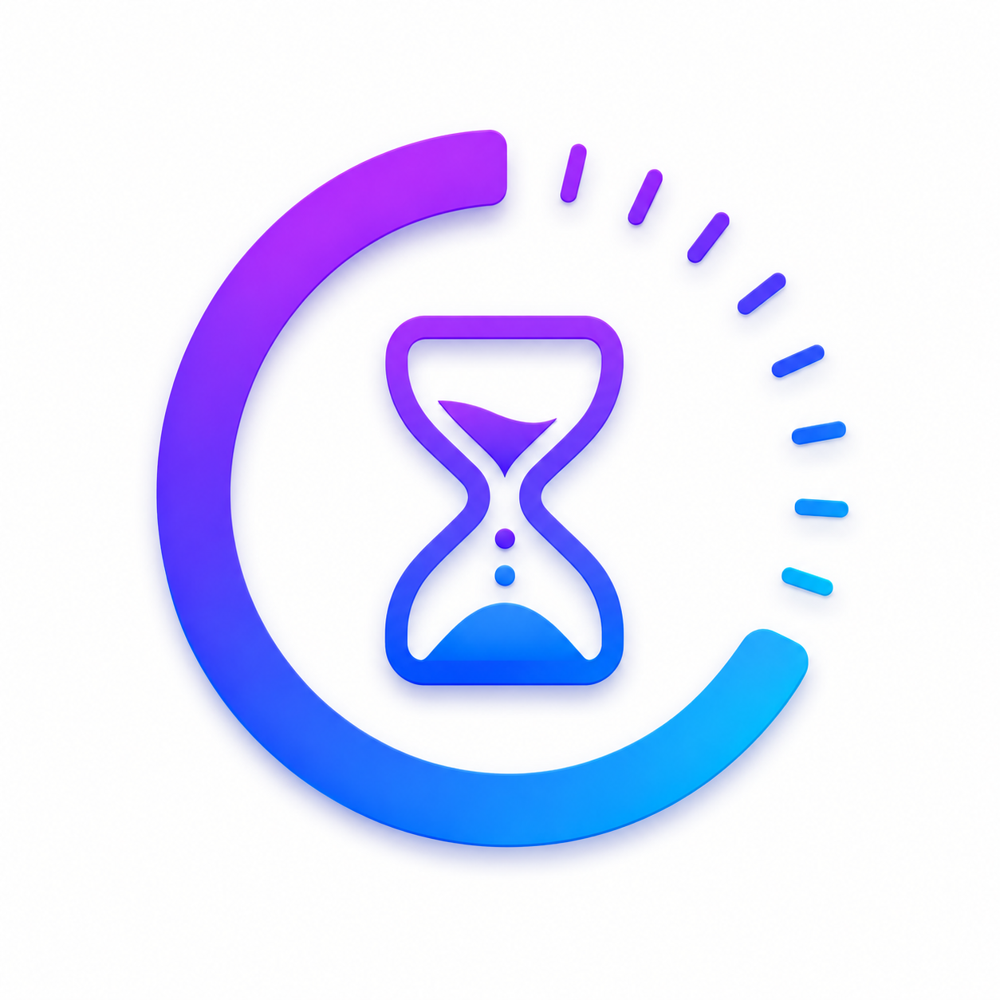
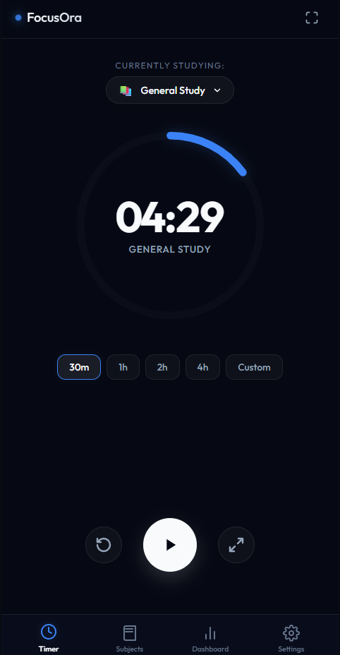
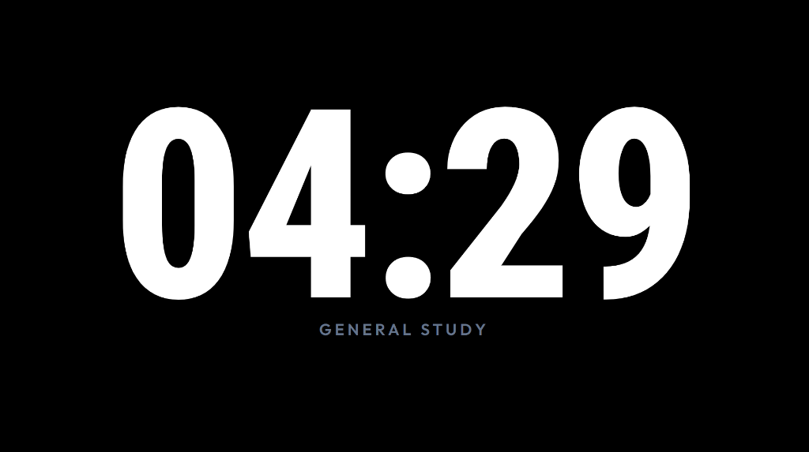
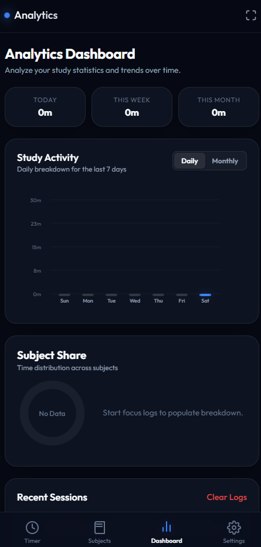
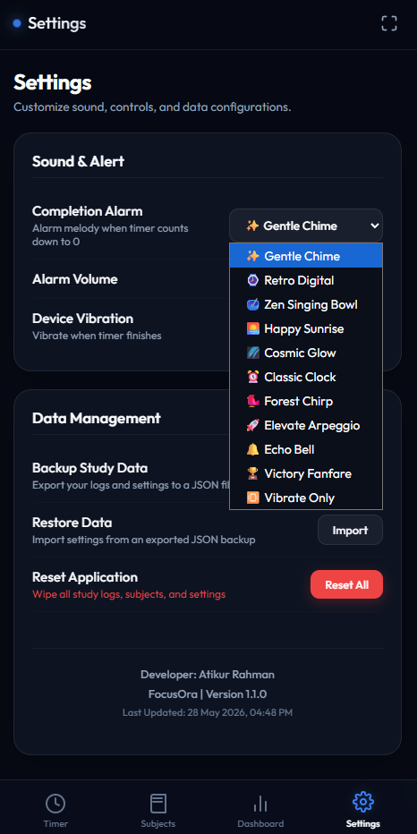

<p align="center">
  
</p>

<h1 align="center">FocusOra - Premium Study Clock & Focus Timer ⏳📚</h1>

<p align="center">
  <b>Transform your desk into an aesthetic, distraction-free productivity space.</b><br>
  <i>Designed for deep work, exam prep, IELTS practice, and daily study routines on Android.</i>
</p>

<p align="center">
  
  
  
  
  
</p>

---

## 📸 App Screenshots (অ্যাপের প্রিভিউ)

<table align="center">
  <tr>
    <td align="center" width="50%">
      <b>⏱️ Precision Focus Timer</b><br>
      <i>Quick presets (30m, 1h, 2h, 4h) & custom picker</i><br><br>
      
    </td>
    <td align="center" width="50%">
      <b>🌙 AMOLED Desk Clock Mode</b><br>
      <i>Distraction-free pitch-black landscape clock</i><br><br>
      
    </td>
  </tr>
  <tr>
    <td align="center" width="50%">
      <b>📊 Study Activity Dashboard</b><br>
      <i>Daily & monthly SVG bar charts + subject share</i><br><br>
      
    </td>
    <td align="center" width="50%">
      <b>⚙️ Procedural Sound Engine & Settings</b><br>
      <i>10 synthesized ambient alarms + developer credit</i><br><br>
      
    </td>
  </tr>
</table>

---

## 📌 GitHub Repository Details (About সেকশন)

গিটহাবে রিপোজিটরি তৈরি বা এডিট করার সময় ডানপাশের **About** সেকশনে এই লেখাগুলো কপি-পেস্ট করুন:

* **Repository Name:** `FocusOra` *(অথবা `focusora-study-timer`)*
* **Description (About):**
  > `FocusOra - A modern, distraction-free study clock & focus timer for Android with live notifications, AMOLED fullscreen mode, subject tracking, and analytics.`
* **Topics / Tags:**
  `android`, `study-timer`, `pomodoro`, `focus-clock`, `capacitor`, `javascript`, `dark-mode`, `ielts-preparation`, `study-tracker`, `productivity`

---

## ✨ Features Breakdown

### ⏱️ Precision Focus Timer
* Instant quick presets: **30m**, **1h**, **2h**, and **4h**.
* Custom time picker to dial any exact hours and minutes.
* High-accuracy loop with background time compensation.

### 🔔 Live Background Countdown Notification (Android Foreground Service)
* Minimizing the app won't stop your study session!
* A live-updating notification appears in your Android status shade, ticking down `[Subject]: MM:SS remaining` every single second.
* Automatically dismisses once paused, reset, or completed.

### ⚠️ Final 5-Second Warning Alarm & Haptic Vibration
* At 5 seconds remaining, a gentle warning chime sequence (5, 4, 3, 2, 1) and light haptic pulses alert you before completion.
* Never get startled by an unexpected loud alarm.

### 🌙 Pitch-Black AMOLED Fullscreen Desk Clock
* Tap the fullscreen button or rotate your phone to landscape.
* Giant ultra-crisp digits on a pure black background—zero distractions on your study table.
* Double-tap anywhere to seamlessly return to the main controls.

### 📱 Keep-Screen-Awake
* Built-in native Android window flags and HTML5 Screen Wake Lock ensure your display never sleeps during focus sessions.

### 📊 Comprehensive Study Analytics Dashboard
* **Daily Breakdown:** Visual 7-day study activity bar chart with active-day neon highlight.
* **Monthly Comparison:** 6-month historical study trend chart.
* **Subject Share Donut:** Dynamic proportional ring displaying exact study time and percentage per topic.
* **History Feed:** Chronological list of completed focus logs with safe confirmation dialogs.

### 📚 15 Academic & IELTS Subject Categories
* Create and color-code custom subjects.
* Includes dedicated academic emojis:
  * 📖 Reading, 📝 Writing, 🎧 Listening, 🗣️ Speaking, 🎓 Exam, 📚 Study, 📐 Math, 💻 Coding, 🧪 Science, 🎨 Art, and more!

### 🎵 10 Built-In Procedural Ambient Alarms
* 100% offline, zero audio files to download—generated mathematically in real time via the Web Audio API:
  * *Gentle Chime, Retro Digital, Zen Singing Bowl, Happy Sunrise, Cosmic Glow, Classic Clock, Forest Chirp, Elevate Arpeggio, Echo Bell, Victory Fanfare.*
* Master volume control and instant test preview.

### 💾 Private, Safe & Offline
* 100% offline operation. No accounts, no cloud sync, no tracking, and zero ads.
* Complete JSON backup and restore functionality anytime in Settings.

---

## 🛠️ Tech Stack & Architecture

* **UI Layer:** HTML5, CSS3 (Modern Glassmorphic Dark UI), JavaScript (ES6+).
* **Native Runtime:** [Capacitor 8](https://capacitorjs.com/) Android bridge.
* **Native Android Java:**
  * `TimerService.java`: Android Foreground Service for live notification countdown.
  * `TimerPlugin.java`: Native Capacitor plugin bridge.
  * `MainActivity.java`: Keep-screen-on window management.
* **Audio Engine:** Pure Web Audio API (`OscillatorNode`, `GainNode`, `BiquadFilterNode`).
* **Visualizations:** Lightweight responsive vector SVGs with zero heavy external charting dependencies.

---

## 🚀 How to Upload to GitHub (গিটহাবে আপলোড করার বিস্তারিত গাইড)

আপনার প্রজেক্টটি ফ্রেশভাবে GitHub-এ আপলোড করতে নিচের ধাপগুলো অনুসরণ করুন:

### ধাপ ১: গিটহাবে একটি নতুন রিপোজিটরি তৈরি করুন
1. [GitHub](https://github.com/) এ লগইন করে ডানপাশের **`+`** আইকনে ক্লিক করে **`New repository`** সিলেক্ট করুন।
2. **Repository name** দিন: `FocusOra`
3. Description-এ উপরের দেওয়া About টেক্সটটি পেস্ট করুন।
4. **Public** সিলেক্ট করুন।
5. ⚠️ **"Add a README file"**, **".gitignore"**, বা **"License"** আনচেক (খালি) রাখবেন, কারণ আমাদের প্রজেক্টে এগুলো আগেই তৈরি করা আছে।
6. **`Create repository`** বাটনে ক্লিক করুন।
7. তৈরি হওয়ার পর আপনার রিপোজিটরির URL টি কপি করে নিন (যেমন: `https://github.com/your-username/FocusOra.git`)।

### ধাপ ২: টার্মিনালে কমান্ড রান করুন
প্রজেক্ট ফোল্ডারে PowerShell বা Command Prompt ওপেন করে নিচের কমান্ডগুলো একে একে লিখুন:

```bash
# ১. গিট ইনিশিয়ালাইজ করুন
git init

# ২. সব ফাইল স্টেজিংয়ে যুক্ত করুন (.gitignore ভারী ক্যাশ ফাইলগুলো অটোমেটিক বাদ রাখবে)
git add .

# ৩. প্রথম কমিট তৈরি করুন
git commit -m "feat: initial release of FocusOra v1.1.0 with screenshots and docs"

# ৪. ডিফল্ট ব্রাঞ্চ main সিলেক্ট করুন
git branch -M main

# ৫. আপনার গিটহাব রিপোজিটরির সাথে লিংক করুন (your-username এর জায়গায় আপনার ইউজারনেম দিন)
git remote add origin https://github.com/your-username/FocusOra.git

# ৬. গিটহাবে আপলোড (Push) করুন
git push -u origin main
```

---

## ⚡ How to Build the Android APK (নতুন করে APK বিল্ড করার নিয়ম)

### দ্রুত ১-ক্লিকে বিল্ড (1-Click Automation):
প্রজেক্ট ফোল্ডারে থাকা **`build_apk.bat`** ফাইলে ডাবল-ক্লিক করুন। স্ক্রিপ্টটি স্বয়ংক্রিয়ভাবে:
1. ওয়েব অ্যাসেটস সিঙ্ক করবে।
2. `logo.png` থেকে সব রেজোলিউশনের অ্যান্ড্রয়েড লঞ্চার আইকন তৈরি করবে।
3. Gradle দিয়ে প্রোজেক্ট কম্পাইল করে রুট ডিরেক্টরিতে **`FocusOra_Timer.apk`** তৈরি করে দেবে।

---

## 👨‍💻 Developer & Credits

* **Developer:** **Atikur Rahman**
* **Project Name:** FocusOra
* **Current Version:** v1.1.0

## 📄 License
This project is open-source and released under the [MIT License](LICENSE).
